# TouchyWeather ⌚🌦️
**Weather, but with attitude.**

TouchyWeather is a card-based weather app for Pebble that mixes useful forecast data with personality.
It's designed around fast glances, quick swipes, and weather advice that can be practical, sarcastic, and occasionally unreasonably honest.

<div align="center">

**v2.0.0** · Runs on **Pebble Time · Time Round · Pebble 2 · Pebble 2 Duo · Pebble Time 2 · Pebble Round 2**

</div>

---

## 🌟 What makes it different

**Touch-first, button-complete.** TouchyWeather started as a touchscreen-only app for the Pebble Time 2 and Round 2 — swipe between cards, pull down to refresh, swipe up for detail. It now runs on the whole modern Pebble lineup, and *every* touch gesture has a button equivalent. Touch is always an enhancement, never a requirement.

**Your deck, your rules.** Twelve cards, and you decide which ones exist and in what order — from the watch or from your phone.

**It has opinions.** The Touch & Go card reads live conditions and tells you what it thinks. It is not always polite about it.

---

## Feature Overview

TouchyWeather is a carousel of focused weather cards:

| Card | What it shows |
|---|---|
| **Main** | Current temp, feels-like, high/low, wind speed + direction, humidity (or dew point), optional location name, and a rain/last-updated banner |
| **Touch & Go** | Live weather personality — classifies conditions into 15 tiers and picks a fitting line |
| **6 Hours** | Next six hours: time, condition, temperature, wind, and expected rainfall |
| **Week Ahead** | Five-day forecast with highs, lows and rain probability |
| **Precipitation** | Bar chart of rain probability, Now → +4h |
| **UV** | Gauge with current UV index, risk label, and the day's peak |
| **Air Quality** | AQI gauge with descriptive label (plus pollen level where available) |
| **Sun Cycle** | Sunrise and sunset times |
| **Night Sky** | Moon phase name and illumination |
| **Golden Hour** | Blue-hour and golden-hour windows, morning and evening |
| **Radar** | Live precipitation radar streamed onto the watch, centred on your location |
| **Settings** | Show, hide and reorder cards right on the watch |

Five of the forecast cards (**6 Hours, Week, Precipitation, UV, Air Quality**) also open a **detail sheet** with deeper charts — hold SELECT, or swipe up on a touchscreen.

---

## Screenshots

Each card on **Pebble Time 2** (emery, 200×228 rect) and **Pebble Round 2** (gabbro, 260×260 round).

<table>
  <tr>
    <th>Pebble Time 2</th>
    <th>Pebble Round 2</th>
    <th>Description</th>
  </tr>
  <tr>
    <td>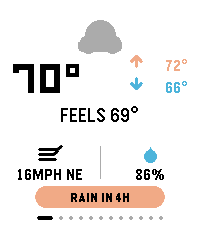</td>
    <td>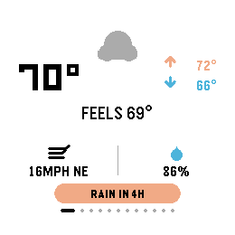</td>
    <td><strong>Main</strong><br>At-a-glance current conditions: temperature, feels-like, high/low, wind speed &amp; direction, and humidity (swap it for dew point in settings). An optional location name sits at the top. The bottom banner alternates between the next precipitation event and how fresh the data is.</td>
  </tr>
  <tr>
    <td>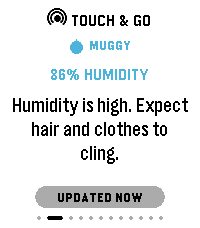</td>
    <td>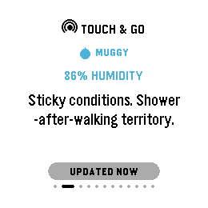</td>
    <td><strong>Touch &amp; Go</strong><br>The personality engine. Classifies live conditions into a tier — storm, rain soon, hot, cold, wind, high UV, bad air, muggy, pleasant… — and delivers a witty or practical one-liner. The tier badge and the driving reading ("FEELS LIKE 89°") are shown above it so you know <em>why</em> it said that.</td>
  </tr>
  <tr>
    <td>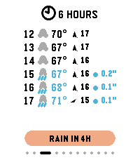</td>
    <td>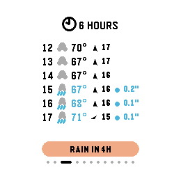</td>
    <td><strong>6 Hours</strong><br>Hour-by-hour outlook for the next six hours: time, condition icon, temperature, wind speed with a direction arrow, and expected rainfall. Hold SELECT for a temperature-trend chart.</td>
  </tr>
  <tr>
    <td>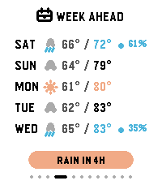</td>
    <td>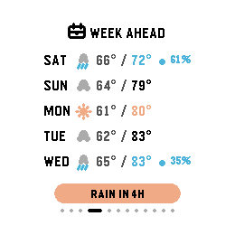</td>
    <td><strong>Week Ahead</strong><br>Five-day forecast: day name, condition icon, low/high, and rain probability. Hold SELECT to page through one detailed day at a time.</td>
  </tr>
  <tr>
    <td>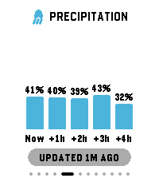</td>
    <td>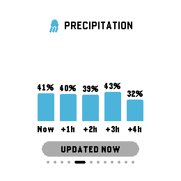</td>
    <td><strong>Precipitation</strong><br>Bar chart of rain probability across the next several hours (Now → +4h), giving a visual sense of how quickly rain is arriving or clearing. Hold SELECT for hourly rainfall amounts.</td>
  </tr>
  <tr>
    <td>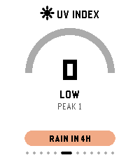</td>
    <td>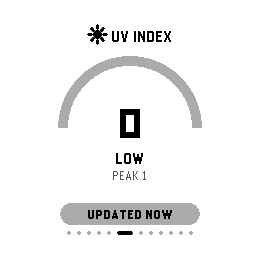</td>
    <td><strong>UV Index</strong><br>Gauge-style dial showing the current UV index, its risk label (Low / Moderate / High / …) and the day's peak. Hold SELECT for the hourly UV curve.</td>
  </tr>
  <tr>
    <td>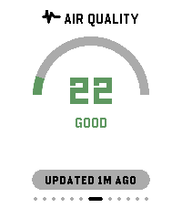</td>
    <td>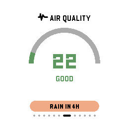</td>
    <td><strong>Air Quality</strong><br>AQI gauge with a descriptive label (Good / Moderate / Unhealthy / …), plus a pollen level line where pollen data is available. Hold SELECT for the pollutant breakdown — PM2.5, PM10, ozone, NO₂.</td>
  </tr>
  <tr>
    <td>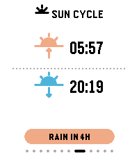</td>
    <td>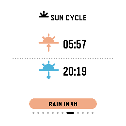</td>
    <td><strong>Sun Cycle</strong><br>Sunrise and sunset for your location, with distinct up/down icons, so you can plan around available daylight.</td>
  </tr>
  <tr>
    <td>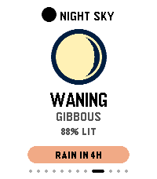</td>
    <td>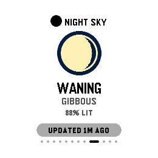</td>
    <td><strong>Night Sky</strong><br>Current moon phase name and illumination percentage, rendered with a large moon-phase illustration.</td>
  </tr>
  <tr>
    <td>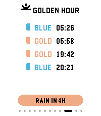</td>
    <td>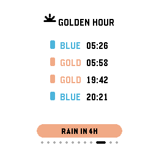</td>
    <td><strong>Golden Hour</strong><br>Blue-hour and golden-hour times for both morning and evening, colour-coded blue and gold. For photographers chasing the best light.</td>
  </tr>
  <tr>
    <td>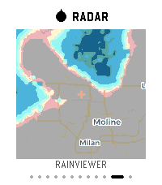</td>
    <td>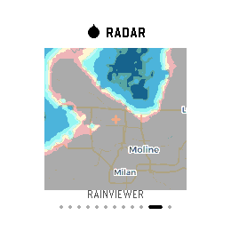</td>
    <td><strong>Radar</strong><br>Live precipitation radar streamed to the watch as pre-quantized pixels and rendered on-device, with a crosshair on your exact location and RainViewer attribution. Press <strong>SELECT</strong> to force a refresh.</td>
  </tr>
  <tr>
    <td>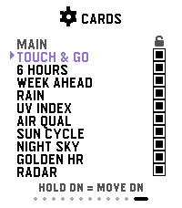</td>
    <td>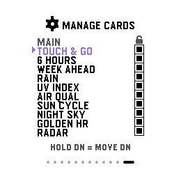</td>
    <td><strong>Settings — Manage Cards</strong><br>Toggle any card on or off to build your ideal weather deck, and hold UP/DOWN to reorder it. Main is locked first and Settings locked last; everything in between is yours.</td>
  </tr>
</table>

---

## Beyond the carousel

<table>
  <tr>
    <td>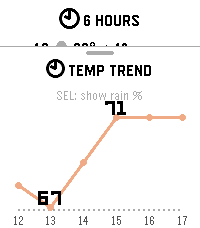</td>
    <td>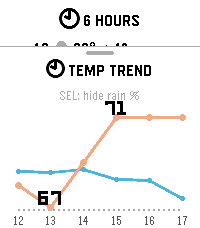</td>
    <td><strong>Detail sheets</strong><br>Hold <strong>SELECT</strong> (or swipe up) on 6 Hours, Week, Precipitation, UV or Air Quality and a bottom sheet slides up with a deeper vector chart. Here: the temperature trend, and the same chart with the rain-probability overlay toggled on with SELECT. BACK — or a downward flick — dismisses it.</td>
  </tr>
  <tr>
    <td>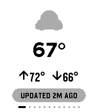</td>
    <td>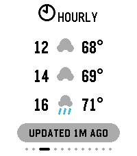</td>
    <td><strong>Big Mode</strong><br>An accessibility mode for reduced eyesight: much larger fonts, high-contrast colours, and simplified cards that show fewer, bigger items. The main card drops to temperature and condition; forecast cards show fewer rows. The full detail is still one SELECT-hold away.</td>
  </tr>
  <tr>
    <td></td>
    <td>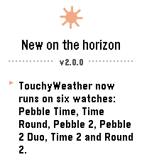</td>
    <td><strong>Refresh sheet &amp; What's New</strong><br>Pull down (or press SELECT on the main card) and a sheet slides in with a spinner and live status while fresh data is fetched. After an update, a one-time "New on the horizon" screen tells you what changed — generated straight from the changelog at build time.</td>
  </tr>
</table>

---

## Runs on every modern Pebble

TouchyWeather ships for six platforms, with **graceful degradation** rather than blocked features: nothing is a hard requirement, and no platform loses a weather *feature* — non-touch models lose touch *gestures* (every one has a button equivalent), and black-and-white models additionally lose radar and colour accents.

| Platform | Model | Display | Colour | Touch | Radar |
|---|---|---|---|---|---|
| `emery` | Pebble Time 2 | 200×228 rect | ✅ | ✅ | ✅ |
| `gabbro` | Pebble Round 2 | 260×260 round | ✅ | ✅ | ✅ |
| `basalt` | Pebble Time | 144×168 rect | ✅ | — | — |
| `chalk` | Pebble Time Round | 180×180 round | ✅ | — | — |
| `diorite` | Pebble 2 | 144×168 rect | B&W | — | — |
| `flint` | Pebble 2 Duo | 144×168 rect | B&W | — | — |

Radar needs ~51 KB of peak heap to assemble a frame, which only the 128 KB App RAM models (emery, gabbro) can spare — so it is carved out of the carousel everywhere else rather than failing at runtime. Layouts branch across four screen classes (small-rect, small-round, large-rect, large-round) so each display gets geometry tuned for it.

<table>
  <tr>
    <td align="center">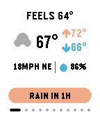</td>
    <td align="center">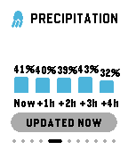</td>
    <td><strong>Pebble Time</strong> — 144×168 colour, button-driven. Same cards, tuned for the small-rect screen.</td>
  </tr>
  <tr>
    <td align="center">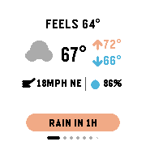</td>
    <td align="center">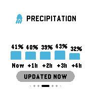</td>
    <td><strong>Pebble Time Round</strong> — 180×180, its own small-round layout class with margins that clear the bezel curve.</td>
  </tr>
  <tr>
    <td align="center">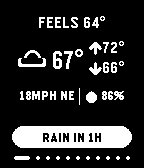</td>
    <td align="center">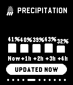</td>
    <td><strong>Pebble 2</strong> — 1-bit black &amp; white. Colour accents become dither patterns, so charts and icons stay readable without hue.</td>
  </tr>
</table>

---

## Controls

Touch is an enhancement. Every action has a button path.

| Gesture | What it does |
|---|---|
| **UP / DOWN** | Previous / next card |
| **UP / DOWN (hold)** | Reorder the highlighted row — Settings card only |
| **SELECT** | Main → refresh weather · Radar → refresh radar · Settings → toggle the highlighted card · in a detail sheet → toggle its secondary overlay · elsewhere → flip light/dark theme |
| **SELECT (hold)** | Open the detail sheet on 6 Hours / Week / Precipitation / UV / Air Quality · elsewhere → flip theme |
| **BACK** | Dismiss an open sheet, otherwise exit |
| **Swipe left / right** *(touch)* | Previous / next card |
| **Pull down** *(touch)* | Refresh weather |
| **Swipe up** *(touch)* | Open the current card's detail sheet |
| **Tap** *(touch)* | Move the cursor on the Settings card |

Prefer not to change themes by accident? Turn **SELECT switches theme** off in settings and the gesture goes quiet everywhere it isn't doing something else.

---

## Settings

Card management lives **on the watch** by default — the Settings card shows/hides with SELECT and reorders with an UP/DOWN hold. Everything else lives in the phone settings page (Clay):

- **Appearance** — light/dark theme · time format (match watch / 12h / 24h) · animations on/off · Big Mode
- **Units** — imperial or metric · humidity or dew point
- **Navigation** — loop cards at the edges (turn it off to make TouchyWeather a Quick Launch app you exit with the buttons) · SELECT switches theme
- **Background updates** — fetch weather while the app is closed, every 30 minutes or every hour
- **Card visibility** — optionally hand card show/hide and ordering to the phone, auto-hide Rain & Radar when it's dry, and hide the Settings card entirely
- **Location** — use phone GPS or pin a manual `lat,lon` · show the location name on the main card

Card management is deliberately fail-safe: the Settings card can only be hidden while phone-side card management is on, so control is always reachable from at least one place.

---

## Touch & Go (the personality engine)

Touch & Go classifies live conditions into one of fifteen tiers — storm, rain soon, rain now, cold rain, snow, hot, cold, wind, high UV, bad air, muggy, pleasant (day / night / cool), and stale data — then picks a fitting line from that tier's pool.

Real lines from the app:

- "**Electrical storm active. Don't be a conductor.**"
- "**Hydrate or wilt. It is cooking out there.**"
- "**Window's closing. Move fast.**"
- "**Slush is the new ice. Step lighter.**"
- "**Wet phone risk: high. Pocket it safely.**"

It's meant to feel like your weather app has opinions.

---

## Where the data comes from

- **Forecast & air quality** — [Open-Meteo](https://open-meteo.com)
- **Radar** — [RainViewer](https://www.rainviewer.com), fetched and re-encoded for the watch by a small Vercel proxy in [proxy/](proxy/)
- **Location name** — BigDataCloud reverse geocoding
- **Pollen** — Open-Meteo CAMS in Europe, a proxied Google Pollen lookup elsewhere

Weather is cached on the watch, so the last reading is on screen before the first byte of a new one arrives. On exit — and after every background fetch — the app publishes a launcher glance, so its launcher entry shows the current temp and condition without opening it.

**Analytics:** the app sends one anonymous ping per day so active-user counts can be tracked. It carries a per-user token (no name, no email), hashed server-side, and coordinates rounded to 0.1° (~11 km). Nothing else leaves the device, and a failed ping never affects weather.

---

## Build / Run

```bash
pebble build
```

Install to an emulator (add `--vnc` on headless machines):

```bash
pebble install --emulator emery --vnc
```

Take a screenshot:

```bash
pebble screenshot --emulator emery --vnc --no-open screenshot.png
```

Releases are driven by [CHANGELOG.md](CHANGELOG.md): the build reads the top `## x.y.z` entry, generates the version header from it, and turns its bullets into the in-app "What's New" screen. Bump `package.json` to match and the build will warn if they drift.

---

## License

This project is licensed under a Source-Available Hybrid License (CC BY-NC 4.0 with Marketplace Restrictions).

Please see the full [LICENSE.md](LICENSE.md) file for details regarding permissions, non-commercial use, and app store distribution rules.
